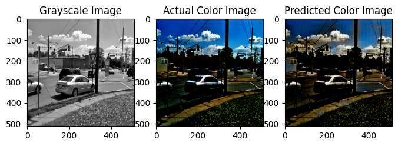
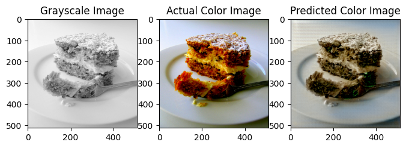
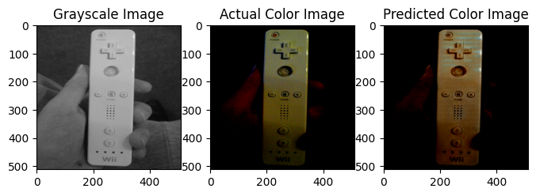
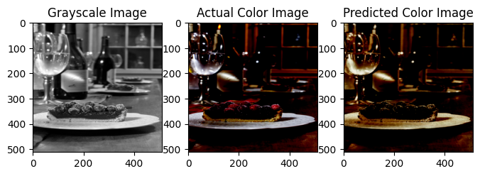

# colorforces
This project presents ”Colorforces,” a deep learning-based solution for automatic colorization of grayscale images. Leveraging Convolutional Neural Networks (CNNs), our approach aims to breathe new life into historical and monochrome photographs and videos. The primary objective is to develop a Jupyter Notebook-based tool capable of taking grayscale images as input and producing vividly colorized versions as output. The project’s scope extends to the potential application of the colorization model for processing grayscale videos. The paper details the dataset, methodology, models, training process, and concludes with an evaluation of the results.

